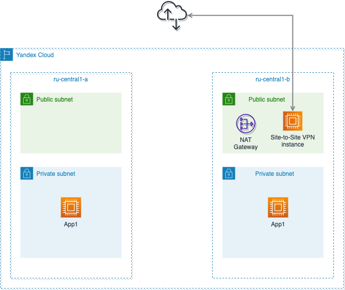

## Terraform manifest for Yandex Cloud

### Description
Terraform allows to provision the most simple infrastructure in Yandex Cloud:
- VPC networks (2 public networks, 2 private networks in 2 different AZ)
- Instances for App1 in 2 AZ
- Instance for Site-to-Site VPN (Strongswan)

### Networking diagram


## level 1 (network infrastructure):
- VPC
- Subnets
- Routes

## level 2 (Instances):
- Site-to-Site VPN based on Strongswan
- Compute instances for App1

### Release notes
In version 1.1.1 basic settings are used.

### This git direcory contains:
1. Terraform HCL manifests for Yandex Cloud
2. Userdata with bash script for instances
3. Network diagram

### Usage options:
1. Terraform apply from level1 directory
2. Terraform apply from level2 directory
```
cd level1
terraform apply
cd ../level2
terraform apply
```